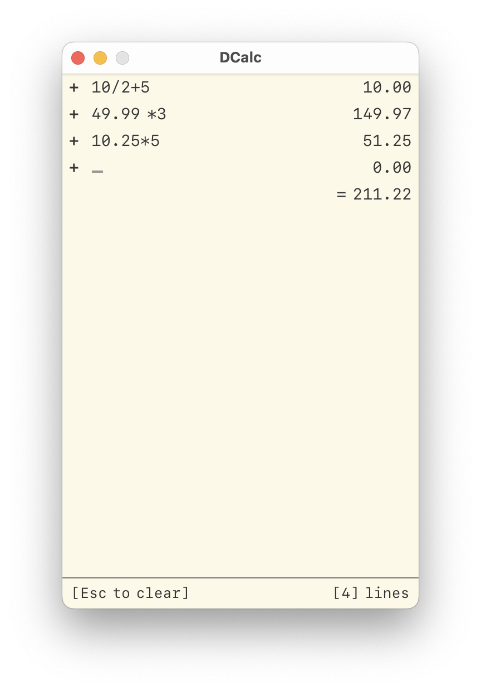

# DCalc
A helpful lightweight calculator app built with Go for Mac, Windows

## About

DCalc is a helpful lightweight calculator app built with Go for Mac, Windows.



## Installation

System requirements:
- Go 1.16 or higher

To install DCalc, run the following command in your terminal:

Install wails:
```bash
go install github.com/wailsapp/wails/v2/cmd/wails@latest
```

Clone the repository:
```bash
git clone http:
cd DCalc
go mod tidy
wails build -platform <platform>

```

Platform options:

| Platform      | Description |
| ----------- | ----------- |
| darwin      | MacOS + architecture of build machine       |
| darwin/amd64   | MacOS 10.13+ AMD64        |
| darwin/arm64   | MacOS 11.0+ ARM64        |
| darwin/universal   | MacOS AMD64+ARM64 universal application        |
| windows      | Windows 10/11 + architecture of build machine       |
| windows/amd64   | Windows 10/11 AMD64        |
| windows/arm64      | Windows 10/11 ARM64       |


## Development

To run DCalc in development mode, run the following command in your terminal:

```bash
wails dev
```

## License

[MIT License](LICENSE)